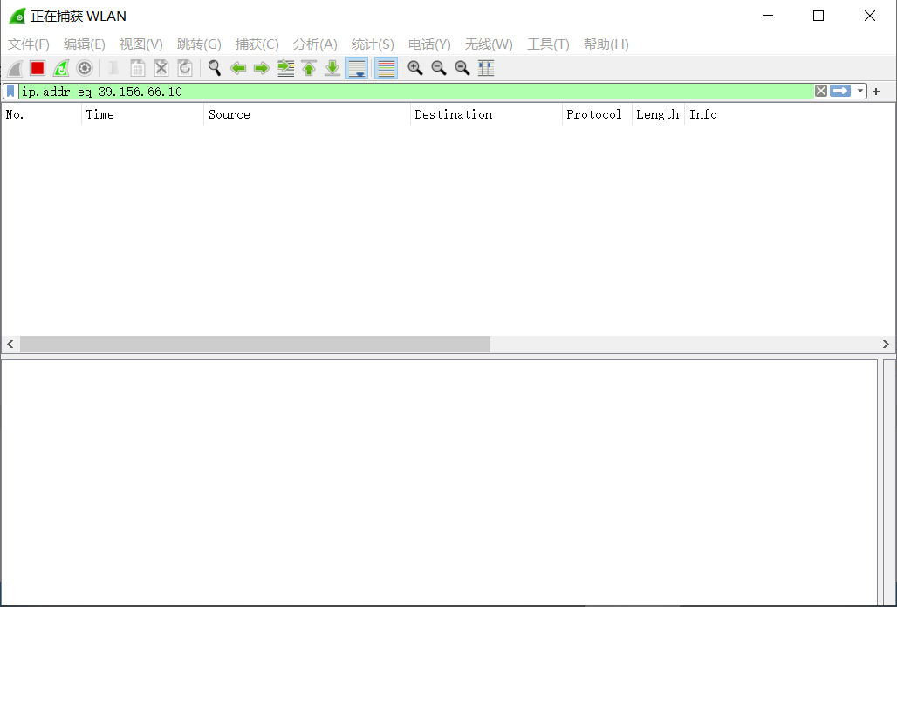
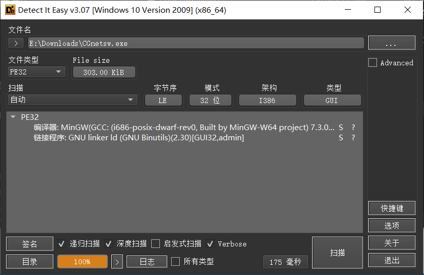
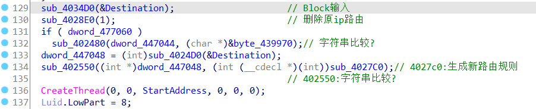
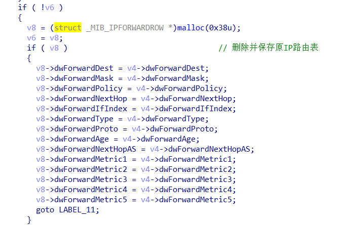
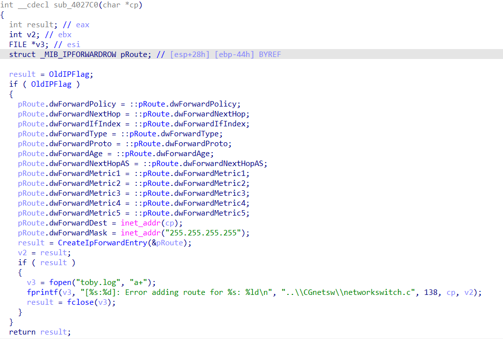
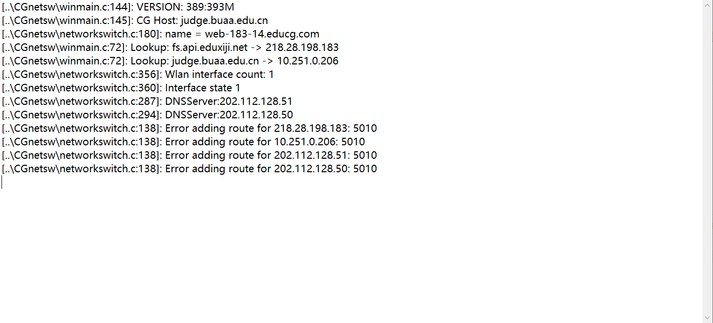
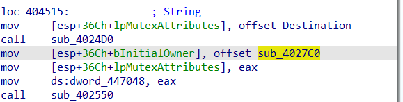

# De 一下`CGnetsw.exe`的 BUG

## 前言

航专在 DS 的期中考中使用了`CGnetsw.exe`来限制学生在考试期间联网

遗憾的是,在关掉这个客户端后,我的电脑还是不能上网<s>,可见你航计算机系的强劲实力</s>

> Tips:你说得对,但是希冀：计算机专业课程一体化平台是由 BUAA 引领研发的一款教学平台,最后外包出去挣钱了
> 详情可见[这里](https://www.educg.net.cn/about.html)

正好五一每天都在(<s>奥林匹滋下分</s>)睡觉,不如来 De 一下`CGnetsw.exe`的 Bug

## 分析

打开客户端后,先简单 ping 一下百度,报了`PING：传输失败。常见故障。`。
再抓个包

没有包被发出去,说明`CGnetsw.exe`通过某种方式阻断了所有的数据包
再加上软件运行时需要管理员权限
那么可以推断出软件断网的原理也许是：

- 修改 hosts,只留下考试平台对应 IP,其他全部转发到无效地址
- 全局代理到考试平台服务器

## 逆向

打开`hosts`,没有看到被修改；Win 下实现全局代理也不容易,而且这是一个只有 300kb 的小而美
只能试试能不能逆向出源码
用 DIE 查出来没有壳,那就简单了

> Tips:这里之前用了`PEiD`,查出来居然有`yoda's Protector v1.02`
> 百度了才知道这是`PEiD`的问题,离谱

直接 IDA+F5,得到一份伪代码,找到关键部分的几个函数

通过函数`sub_4028E0`把原来的 IP 路由表删掉

再通过函数`sub_4027C0`生成新的路由表

> 不知道为什么这里没有把函数名还原出来,最后看了佬的文章[1](#refer-anchor-1)才找到这个位置,我是菜 b

到这里,基本断网原理就清楚了,即把原来的路由表替换掉,使得只有考试平台的流量被正确转发,其他全部被转到无效地址
那为什么关闭`CGnetsw.exe`后还是无法联网？路由表不应该被恢复了吗？
想起来运行以后软件会有一个`toby.log`,打开看看

看到有几个 Error,正好就是由`sub_4027C0`打印的
再仔细看看这个函数,发现这个函数本来应该有一个参数`(char *cp)`但是在`main`里面调用的时候,并没有给这个函数传参
我以为是伪代码错了,去看反汇编,也没有看到前后有`char*`型的入栈

那就可以猜想,在关闭程序后,`sub_4027C0`的`CreateIpForwardEntry`调用失败了,导致本机路由没有恢复

## 修复

> 总结:做不到

由于我是 cb,不知道`sub_4027C0`是怎么做到在关闭窗口后调用的,伪代码也没有看到关闭窗口后的相关操作
也许可以用 IDA 的 debugger 来确定,但是我不会
IDA 一共扫出来六百多个函数,也不大可能一个一个看

百度了一下,`CreateIpForwardEntry`是会返回错误代码的,在`toby.log`里面打印出来应该可以确定错误的原因;盲猜是`sub_4027C0`的参数没有正确传递,使得`pRoute.dwForwardDest`重新赋值失败

## 后记

这其实是第一次做逆向,很多东西都是一边百度一边做,谬误肯定难免
不过五一反正没啥事,图一乐吧

## 后后记

迁移博客又打开看了一眼,写得果然很遗憾
<s>写得就是一拖四</s>

### 参考

- [ ] [CGnetsw 修改器](https://hellorootkit.github.io/2021/12/16/CGnetsw%E4%BF%AE%E6%94%B9%E5%99%A8/)

注:文中 2021 版与现版本已不同
