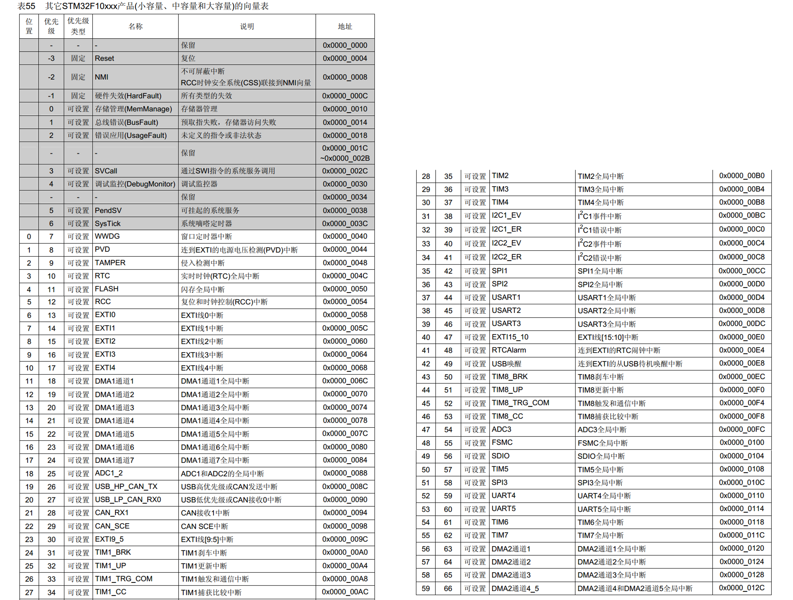
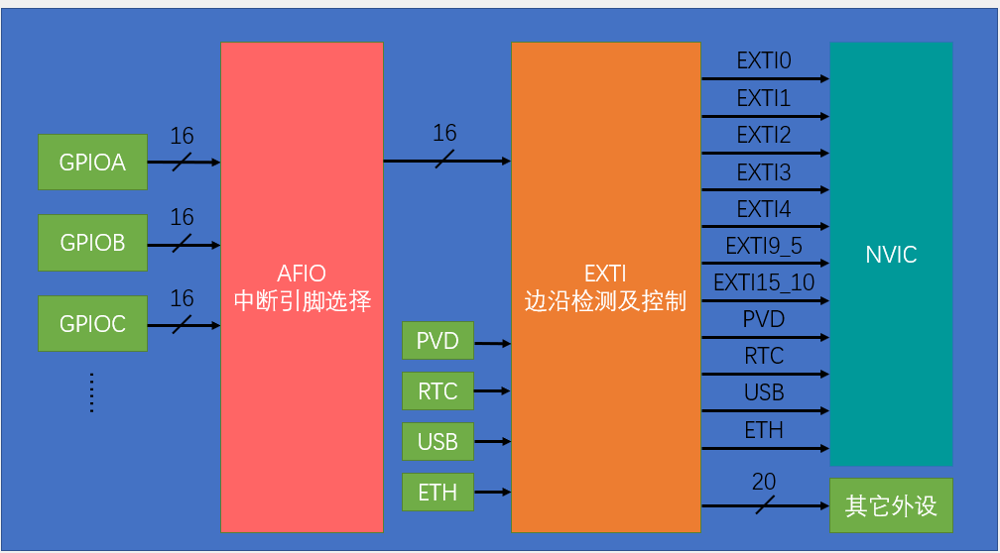

## 中断

在主程序运行中，出现了特定的中断触发条件（中断源），使得 CPU 暂停当前正在运行的程序。转而去处理中断程序，处理完成后又返回原来被暂停的位置继续运行。比如串口通信时，检测到串口输入，需要优先处理串口传入的数据，此时就需要中断。

#### 中断优先级

多个中断同时出现时，CPU 会优先响应更加紧急的中断源。STM32 有 16 个可编程的优先等级，还可进一步设置抢占优先级和响应优先级。

如果一个中断程序正在执行，又有新的更高优先级的中断出现，CPU 将会去处理新的中断，之后再返回当前中断。这种行为被称为中断嵌套。

中断的管理由中断向量控制器 (NVIC) 进行。中断优先级由优先级寄存器的 4 位决定，这 4 位二进制分为高 n 位的抢占优先级与低 4-n 位的响应优先级，值越小优先级越高。

优先级相同的程序按中断号排队，数值小的优先响应。

> 什么是中断号？
> STM32 内置了一张中断向量表，对不同外设引起的中断进行了排序。



<p style="font-size: 13px" align = "center">优先级向量表</p>

- 抢占优先级
 可以直接中断 CPU 当前执行的程序，转而执行抢占优先级高的程序。
- 响应优先级
 待 CPU 当前任务执行完后，优先执行响应优先级高的程序。

#### 优先级的分组

前面提到，优先级分为高 n 位的抢占优先级与低 4-n 位的响应优先级。n 的值决定了优先级分组的方式，如：配置 n=1，则程序可配置的抢占优先级只有第一位，取值为 0~1，响应优先级为后三位，取值为 0~7。

### EXTI(Extern Interrupt)

EXTI，即外部中断，可以检测指定 GPIO 口的电平信号。当指定 GPIO 口的电平变化时，EXTI 向 NVIC 发出中断申请，NVIC 对优先级进行判断后中断 CPU 主程序。

所有 GPIO 口都可以配置触发中断，但相同的 GPIO 引脚不能同时触发中断，即：PA0，PB0 不能同时作为中断引脚。

支持的触发方式有：上升沿、下降沿、双边沿、软件触发

- 上升沿
    低电平到高电平的瞬间触发中断。
- 下降沿
    高电平到低电平的瞬间触发中断。
- 双边沿
    上升沿，下降沿都可以触发中断。
- 软件触发
    程序中执行代码，触发中断。

触发响应的方式有：中断响应、事件响应。

- 中断响应
    将中断发送到 NVIC，执行正常的中断流程。
- 事件响应
    触发其它外设的操作，不经过 CPU。

#### AFIO 复用 IO 口

AFIO 主要用于引脚复用功能的选择和重定义。

- 复用功能选择：从 GPIO 的 16 个引脚中选择一个连接到 EXTI 通道。这也是为什么相同的 pin 不能同时触发中断。



<p style="font-size: 13px" align = "center">EXTI流程</p>

#### EXTI 配置函数

EXTI 较为特殊，使用前不需打开其时钟。NVIC 是内核的外设，无需开启时钟。

##### AFIO

使用前需要开启 AFIO 的时钟，其连接在 APB2 上，使用 `RCC_APB2PeriphColckCmd(RCC_APB2Periph_AFIO, ENABLE)` 语句开启。

##### GPIO

GPIO Pin 需要作为 EXTI 输入线时，一般初始化为浮空、上拉或下拉模式。

- `void GPIO_PinRemapConfig(uint32_t GPIO_Remap, FunctionalState NewState)`

 进行引脚重映射。

- `void GPIO_EXTILineConfig(uint8_t GPIO_PortSource, uint8_t GPIO_PinSource)`

 配置 AFIO 的数据选择器。参数为 (GPIO 外设源，GPIO 引脚)。

##### EXTI

- `void EXTI_DeInit(void)`
  清除所有 EXTI 的配置。
- `void EXTI_Init(EXTI_InitTypeDef* EXTI_InitStruct)`
  与 GPIO_Init 类似，使用结构体初始化 EXTI。
  - `EXTI_InitTypeDef`
  有如下几个成员:

```C
typedef struct
  {
  EXTI_Line//指定中断引脚所在的中断线
  EXTI_LineCmd//中断线的状态，ENABLED or DISABLED
  EXTI_Mode//外部中断线的模式
  EXTI_Trig//触发信号的有效边沿。选择上升沿、下降沿、都触发
  }EXTI_InitTypeDef;
```

- `void EXTI_GenerateSWInterrupt(uint32_t EXTI_Line)`
  软件触发中断。 参数为指定的中断线。
- 状态寄存器
- `FlagStatus EXTI_GetFlagStatus(uint32_t EXTI_Line)`
- `void EXTI_ClearFlag(uint32_t EXTI_Line)`
  读写指定的标志位。
- `ITStatus EXTI_GetITStatus(uint32_t EXTI_Line)`
- `void EXTI_ClearITPendingBit(uint32_t EXTI_Line)`
  只读写中断标志位。

##### NVIC

- `void NVIC_PriorityGroupConfig(uint32_t NVIC_PriorityGroup)`
选择 NVIC 的分组。
- `void NVIC_Init(NVIC_InitTypeDef* NVIC_InitStruct)`
结构体初始化 NVIC。有如下几个成员：

```C
typedef struct

{
NVIC_IRQChannel//指定中断通道
NVIC_IRQChannelCmd//ENABLE or DISABLE
NVIC_IRQChannelSubPriority//响应优先级
NVIC_IRQChannelPreemptionPriority//抢占优先级

} NVIC_InitTypeDef;
```

##### 中断函数

中断函数的名称都是固定的，且无参数，无返回值。名称可查启动向量表 `startup_stm32f10x_md.s`。

中断函数中一般会先判断标志位，是否为我们想要的中断。

中断结束后，需要手动清除标志位。

一般不在中断程序中执行操作硬件的函数，也不在里面执行耗时较长的程序。
