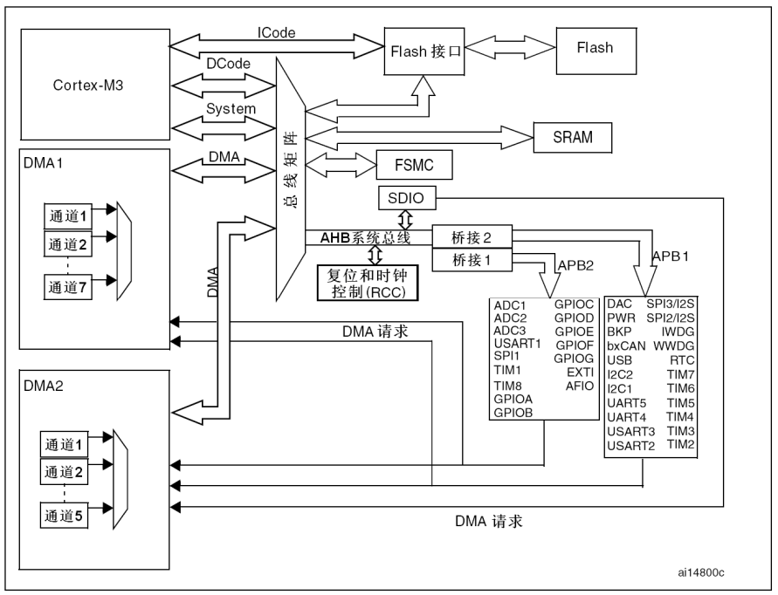
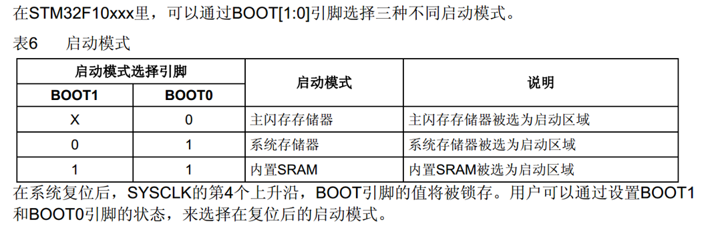

STM32 是一款经典的单片机 (MCU)，由 ST 公司设计，具有丰富的外设资源 (Peripheral)。
本博客基于 `STM32F103C8T6` 撰写。

> 内核即单片机的中央处理单元 (CPU)，负责执行指令、控制外设等。
> 外设是单片机上与 CPU 相连的各种功能模块和接口，包含输入与输出设备、定时器、寄存器等。
> STM32 的内核为 ARM Cortex M 系列，外设由 ST 公司设计。

## 命名规则

- STM32 F 103 C8 T6
    `STM32` 代表该单片机为 ST 设计的 32 位 MCU。
    `F` 代表为通用类型。STM32 系列还有许多其他类型的单片机，如低功耗、无线等。
    `103` 代表该单片机为增强型。
    `C` 代表该单片机有 48 个引脚。
    `8` 代表其拥有 64Kb 的闪存。
    `T` 代表其为 LQFP 封装。
    `6` 代表其适用温度范围为 `-40°C~85°C`。
    详情可以参照 `STM32F10xx使用手册`。

## 基本结构

STM32 内核引出了三条总线，分别是 `ICode总线`、`DCode总线` 与 `System总线`。`ICode总线` 与 `DCode总线` 主要用于连接 Flash 闪存，闪存中存储了我们编写的程序。`Icode总线` 用于加载指令，`Dcode` 总线用于加载数据。`System总线` 则挂载了其他外设。除此之外，还有用于连接外设的 `APB1` `APB2` 总线，`APB1` 的速度比 `APB2` 低。
除了内核以外，STM32 上还有 `DMA控制器(Direct Memory Access)`，可以不经过 CPU 将数据从外设传输到内存，减轻 CPU 的负担。


<p style="font-size:13px" align = "center">整体结构图</p>

### BOOT

在 STM32F10xxx 里，可以通过 BOOT[1:0] 引脚选择三种不同的启动模式。


<p style="font-size: 13px" align = "center">Boot流程</p>
当`BBOT0`为0时，程序从Flash开始执行。
当`BOOT1`为0，`BOOT0`为1时，程序从系统存储器开始执行，一般用于串口下载。系统存储器中存储了`BootLoader`，其接收串口数据，刷新到主闪存中。
当`BOOT1`为1，`BOOT0`为0时，程序从SRAM启动，一般用于调试。
BOOT引脚的值仅在上电后的一瞬间有效。
>计组的同学也许更熟悉？

### 时钟

为了降低功耗，STM32 的时钟需要每个外设单独配置开启。
使用如下函数控制外设的时钟：

- `RCC_AHBPeriphClockCmd(uint32_t RCC_AHBPeriph, FunctionalState NewState)`
- `RCC_APB1PeriphClockCmd(uint32_t RCC_AHBPeriph, FunctionalState NewState)`
- `RCC_APB2PeriphClockCmd(uint32_t RCC_AHBPeriph, FunctionalState NewState)`
这几个函数的参数都是一样的，即：
``
`RCC_AHBPeriphClockCmd(RCC_APB2Periph_GPIOA, ENABLED)//要控制的外设，时钟状态`
使用前需要查阅对应外设连接在哪条总线上，使用对应函数开启。如前所述，`APB1` 的速度较低，连接的是低速外设，如电源接口、USART 等。
而 `APB2` 连接高速外设。如 ADC、GPIO 口等。
详情可见：[这里](https://www.singledog233.top/TIM)

## 条件编译

这里补充一点 C 中条件编译的基础。
条件编译可以让程序根据不同的条件编译特定的代码，而不符合条件的部分不会参与编译。其支持一系列预处理命令，常见用法如下：

```C
#if 整型常量表达式1  
    程序段1  
#elif 整型常量表达式2  
    程序段2  
#elif 整型常量表达式3  
    程序段3  
#else  
    程序段4  
#endif
```

`#elif` `#else` 均可省略。`整型常量表达式` 不能包含变量。

### `#ifdef` 与 `#ifndef`

检测某个宏是否被定义过。如头文件一般会以下面的形式给出：

```C
#ifndef __XX_H
#define __XX_H
......
#endif
```

这样可以避免同一个文件被多次编译。在其第一次编译时，`__XX_H` 被定义。如果第二次编译到这个文件，就不满足 `#ifndef __XX_H`，从而避免了重复编译。
