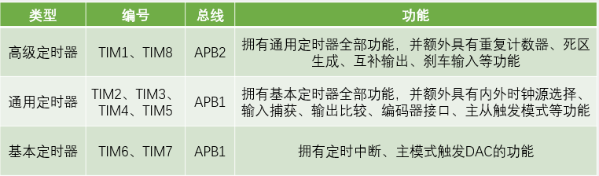
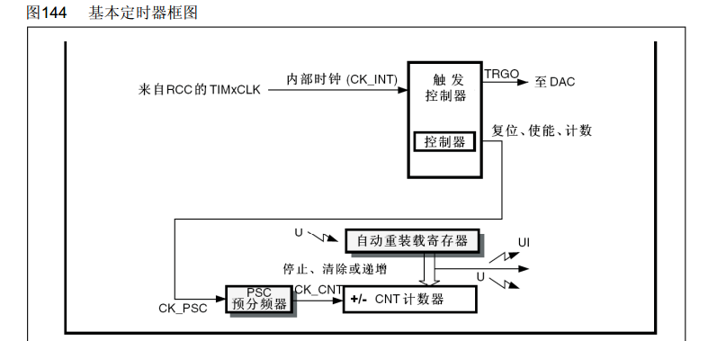
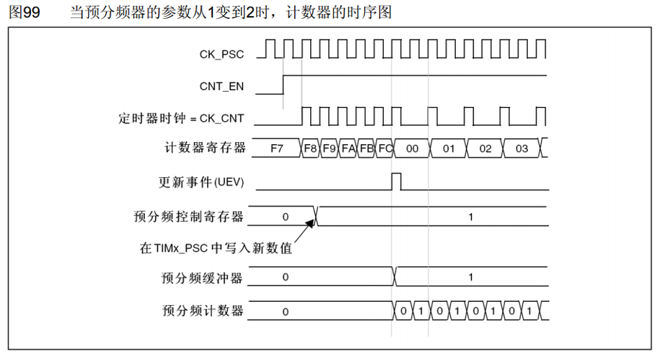
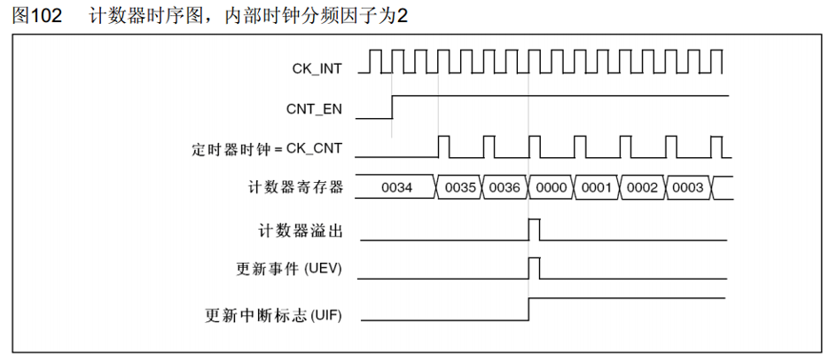
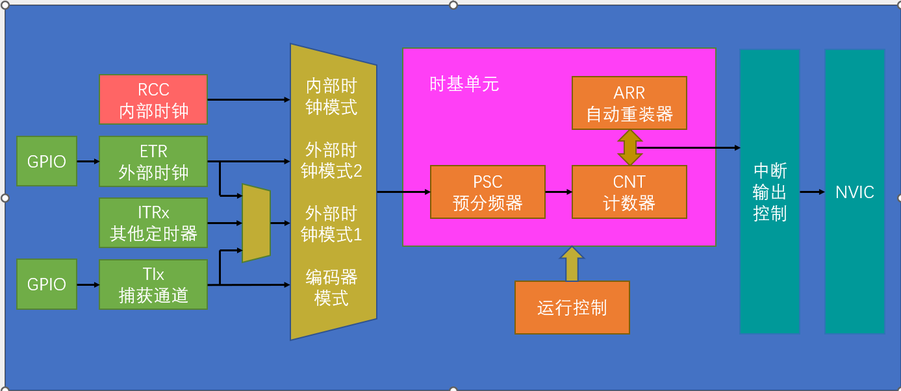

定时器可以对输入的时钟进行计数，并在计数值达到设定值时触发中断。

当输入的时钟稳定可靠时，定时器即可模拟时钟。如 STM32 的定时器的基准时钟一般都是 72MHz，如果对 72MHz 计 72 次数，则每个数为 $1 \upmu s$ ；对其计 72000 次数，则每个数为 $1 ms$。

STM32 的定时器不仅具备基本的定时中断功能，还包含内外时钟源捕获、输出比较、编码器接口、主从触发模式等功能。

## 定时器类型

根据复杂度和应用场景，定时器被分为高级定时器、通用定时器、基本定时器三种类型。



<p style="font-size: 13px" align = "center">定时器类型及功能</p>

高级定时器一般用于控制三相无刷电机。

`STM32F103C8T6` 拥有 TIM1、TIM2、TIM3、TIM4 四个定时器。

## 基本定时器



<p style="font-size: 13px" align = "center">基本定时器</p>
`TIMxCLK`的主频一般是72MHz，即系统主频。
- 预分频器(PSC)
 可以对72MHz的时钟进行预分频。计算公式如下：

$$F_{output}=\frac{F_{input}}{n+1}$$

n 为预设的分频系数。

分频后即可实现对 72MHz 进行不同的计数的功能。如要实现 $1 \upmu s$ 的计时，那么需要对 1MHz 进行计数，则将 n 配置为 71。

- 16 位计数器 (CNT)
    对预分频后的计数时钟进行计数。计数时钟每有一个上升沿，计数器值加一。计数器为 16 位，故计数范围为 0~65535。
- 自动重装寄存器 (ARR)
    存储我们写入的计数目标。当计数的值达到我们写入的目标时，产生一个中断信号，并清零计数器。中断信号随后发往 NVIC，进行下一步处理。这一流程被称为更新中短。除此之外，其还可以触发更新事件，即不触发中断，而触发内部其他电路的工作。
    除了中断之外，定时器还可以设置为主模式触发 DAC，即不触发中断，直接将更新事件通过主模式映射到 TRGO，然后 TRGO 直接触发 DAC，一定程度上可以减轻 CPU 的负担。

## 通用定时器

通用定时器支持向上计数、向下计数、中央计数三种模式。

> 向上计数：计数器自增到目标值，再清零。
> 向下计数：计时器从目标值递减到零，再重置。
> 中央对齐：计时器从零开始递增到目标值，再从目标值递减到零。

通用定时器可以选择内部时钟或外部时钟。外部时钟分为 ETR 引脚的外部时钟输入 2；在需要定时器的级联时，使用外部时钟输入 1。

## 时基单元的时序

### 预分频器时序



<p style="font-size: 13px" align = "center">预分频器的时序图</p>
- CK_PSC：预分频器的输入时钟。
- CNT_EN：表明高电平计数器正常运行，低电平计数器停止运行。
- CNT_CNT：计数器时钟。
- 计数器寄存器：计数。在FC之后，计数器清零，可推断出ARR自动重装值即FC。
- 预分频缓冲器：在预分频器的值更新时，暂时储存预分频器的值；待计数周期结束后，再更新预分频器的值。
计数频率可以根据以下公式计算：

$$CK_{CNT} = CK_{PSC} / (PSC + 1)$$

### 计数器时序



<p style="font-size: 13px" align = "center">计数器时序</p>

- CK_INT：内部时钟。
- CNT_EN：时钟使能，高电平启动。
- CK_CNT：计数器时钟。
- 计数器寄存器：在 `CK_CNT` 的每个上升沿自增，增至 0036 时发生溢出，同时清零，产生一个更新事件，同时置一个更新中断标志位 UIF，申请中断。中断响应后，需要在程序中手动清零。
    计数器溢出频率：

    $$CK\_{CNT\_OV} = CK\_CNT / (ARR + 1)= \frac {CK\_PSC}  {(PSC + 1)  (ARR + 1)}$$

    此外，还可以通过设置 `ARPE=1` 来启用影子寄存器，其作用与预分频器的缓冲寄存器类似，都是为了使值的变化与更新事件同步发生。

## TIM 库函数



<p style="font-size: 13px" align = "center">定时器基本结构</p>
- `TIM_TimeBaseInitTypeDef`

 用于初始化的结构体，成员如下：

- `uint16_t TIM_Prescaler`：PSC 预分频器的值。
- `uint16_t TIM_CounterMode`: 计数器的工作模式

```C
TIM_CounterMode_Up
TIM_CounterMode_Down
TIM_CounterMode_CenterAligned1
TIM_CounterMode_CenterAligned2
TIM_CounterMode_CenterAligned3
```

- `TIM_Period`：ARR 自动重装器的值。
- `TIM_ClockDivision`： 选择滤波器采样信号分频，可取 `TIM_CKD_DIVx`
- `TIM_RepetitionCounter`：重复计数器的值，仅高级计数器。
- `void TIM_DeInit(TIM_TypeDef* TIMx)`
    用于还原 TIM 配置。
- `void TIM_TimeBaseInit(TIM_TypeDef* TIMx, TIM_TimeBaseInitTypeDef* TIM_TimeBaseInitStruct)`
    用于配置时基单元。第一个参数选择要配置的定时器，第二个参数为初始化结构体。
- `void TIM_TimeBaseStructInit(TIM_TimeBaseInitTypeDef* TIM_TimeBaseInitStruct)`
    给初始化结构体赋一个默认值。
- `void TIM_Cmd(TIM_TypeDef* TIMx, FunctionalState NewState)`
    运行控制，使能计数器。`NewState` 可选 `ENABLED` `DISABLED`。
- `void TIM_ITConfig(TIM_TypeDef* TIMx, uint16_t TIM_IT, FunctionalState NewState)`
    使能中断输出。`TIM_IT` 选择配置哪个终端输出。
- 时钟选择函数
  - `void TIM_InternalClockConfig(TIM_TypeDef* TIMx)`
        选择内部时钟。没有时钟选择函数时，默认选择内部时钟。

  - `void TIM_ITRxExternalClockConfig(TIM_TypeDef* TIMx, uint16_t TIM_InputTriggerSource)`
        选择外部时钟，第二个参数选择时钟源。

  - `void TIM_TIxExternalClockConfig(TIM_TypeDef* TIMx, uint16_t TIM_TIxExternalCLKSource,uint16_t TIM_ICPolarity, uint16_t ICFilter)`
        选择 TIx 捕获通道的时钟。`TIM_TIxExternalCLKSource` 选择具体的捕获引脚，`TIM_ICPolarity` 选择输入的极性，`ICFilter` 选择输入的滤波器。
  - `void TIM_ETRClockMode1Config(TIM_TypeDef* TIMx, uint16_t TIM_ExtTRGPrescaler, uint16_t TIM_ExtTRGPolarity,uint16_t ExtTRGFilter);`
        选择从外部时钟模式 1 输入的时钟。`TIM_ExtTRGPrescaler` 为外部触发预分频器。
  - `void TIM_ETRClockMode2Config(TIM_TypeDef* TIMx, uint16_t TIM_ExtTRGPrescaler,uint16_t TIM_ExtTRGPolarity, uint16_t ExtTRGFilter)`;
        选择从外部时钟模式 2 输入的时钟。
  - `void TIM_ETRConfig(TIM_TypeDef* TIMx, uint16_t TIM_ExtTRGPrescaler, uint16_t TIM_ExtTRGPolarity,uint16_t ExtTRGFilter)`
        单独配置 ETR 引脚的预分频器、极性、滤波器。

- 初始化后改变参数的函数
- `void TIM_PrescalerConfig(TIM_TypeDef* TIMx, uint16_t Prescaler, uint16_t TIM_PSCReloadMode)`
    `Prescaler` 为要改变的预分频器值，`TIM_PSCReloadMode` 为要改变的预分频器工作模式。
- `void TIM_CounterModeConfig(TIM_TypeDef* TIMx, uint16_t TIM_CounterMode)`
    选择新的计数器模式。
- `void TIM_ARRPreloadConfig(TIM_TypeDef* TIMx, FunctionalState NewState)`
    配置自动重装寄存器是否需要预装。
- `void TIM_SetCounter(TIM_TypeDef* TIMx, uint16_t Counter)`
- `void TIM_SetAutoreload(TIM_TypeDef* TIMx, uint16_t Autoreload)`
    更改计数器/自动重装寄存器的值。
- `uint16_t TIM_GetCounter(TIM_TypeDef* TIMx)`
- `uint16_t TIM_GetPrescaler(TIM_TypeDef* TIMx)`
 得到计数器/预分频器的值。
